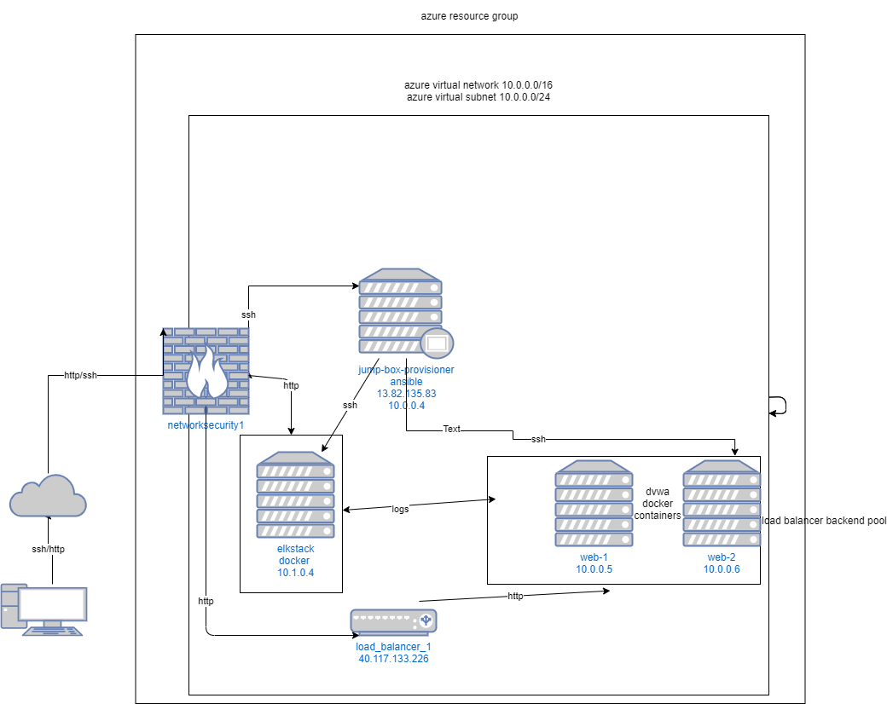

## Automated ELK Stack Deployment

The files in this repository were used to configure the network depicted below.

These files have been tested and used to generate a live ELK deployment on Azure. They can be used to either recreate the entire deployment pictured above. Alternatively, select portions of the _____ file may be used to install only certain pieces of it, such as Filebeat.

  - [Elkplaybook](ansible/elkplaybook.yml)

This document contains the following details:
- Description of the Topologu
- Access Policies
- ELK Configuration
  - Beats in Use
  - Machines Being Monitored
- How to Use the Ansible Build

### Description of the Topology

The main purpose of this network is to expose a load-balanced and monitored instance of DVWA, the D*mn Vulnerable Web Application.

Load balancing ensures that the application will be highly available_____, in addition to restricting access _____ to the network.
- _TODO: What aspect of security do load balancers protect? What is the advantage of a jump box?_
availablity, segments rule management and simplifys things

Integrating an ELK server allows users to easily monitor the vulnerable VMs for changes to the ___files__ and system _logs____.
- _TODO: What does Filebeat watch for?_ changes to files
- _TODO: What does Metricbeat record?_changes to logs

The configuration details of each machine may be found below.
_Note: Use the [Markdown Table Generator](http://www.tablesgenerator.com/markdown_tables) to add/remove values from the table_.

| Name     | Function | IP Address | Operating System |
|----------|----------|------------|------------------|
| Jump Box | Gateway  | 10.0.0.1   | Linux            |
|elkstack  | hosts elk services| 10.1.0.4           | linux                  |
| load_balancer_1    | balances connections for web-1 and web2          |    40.117.133.226        | linux                 |
| web-1/web-2 | dvwa hosting         |  10.0.0.5/10.0.0.6          |     linux             |

### Access Policies

The machines on the internal network are not exposed to the public Internet. 

Only the jumpbox_____ machine can accept connections from the Internet. Access to this machine is only allowed from the following IP addresses:
- my local ip address

Machines within the network can only be accessed by __jumpbox___.
13.82.135.83

A summary of the access policies in place can be found in the table below.

| Name     | Publicly Accessible | Allowed IP Addresses |
|----------|---------------------|----------------------|
| Jump Box | Yes              | my local ip    |
| elk          |    yes                | my local ip                |
| load          |      yes              | my local ip                      |
| web 1/2   | no    |      N/A   |
### Elk Configuration

Ansible was used to automate configuration of the ELK machine. No configuration was performed manually, which is advantageous because...
speed/ scale ability 

The playbook implements the following tasks:
- _TODO: In 3-5 bullets, explain the steps of the ELK installation play. E.g., install Docker; download image; etc._
- apt module uses apt tool to install docker and pip.
- pip module installs docker python module
- systctl assigns more  memory to the machine.
- downloads and launchs container

The following screenshot displays the result of running `docker ps` after successfully configuring the ELK instance.

### Target Machines & Beats
This ELK server is configured to monitor the following machines:
- 10.0.0.5
- 10.0.0.6

We have installed the following Beats on these machines:
- filebeat and metricbeat on web 1 and web 2.

These Beats allow us to collect the following information from each machine:
-filebeat takes the measure of all files and hashs/compares to find changes.
-metricbeat takes logs
### Using the Playbook
In order to use the playbook, you will need to have an Ansible control node already configured. Assuming you have such a control node provisioned: 

SSH into the control node and follow the steps below:
- Copy the playbook file_____ file to /etc/Ansible_____.
- Update the _hosts____ file to include ip and python under corresponding label

- Run the playbook, and navigate to __http://myipaddress:5601/app/kibana__ to check that the installation worked as expected.

_TODO: Answer the following questions to fill in the blanks:_
- _Which file is the playbook? Where do you copy it?_
- _Which file do you update to make Ansible run the playbook on a specific machine? How do I specify which machine to install the ELK server on versus which to install Filebeat on?_
- _Which URL do you navigate to in order to check that the ELK server is running?

_As a **Bonus**, provide the specific commands the user will need to run to download the playbook, update the files, etc._
